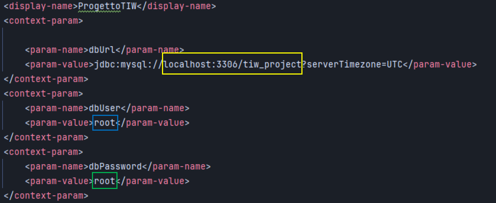
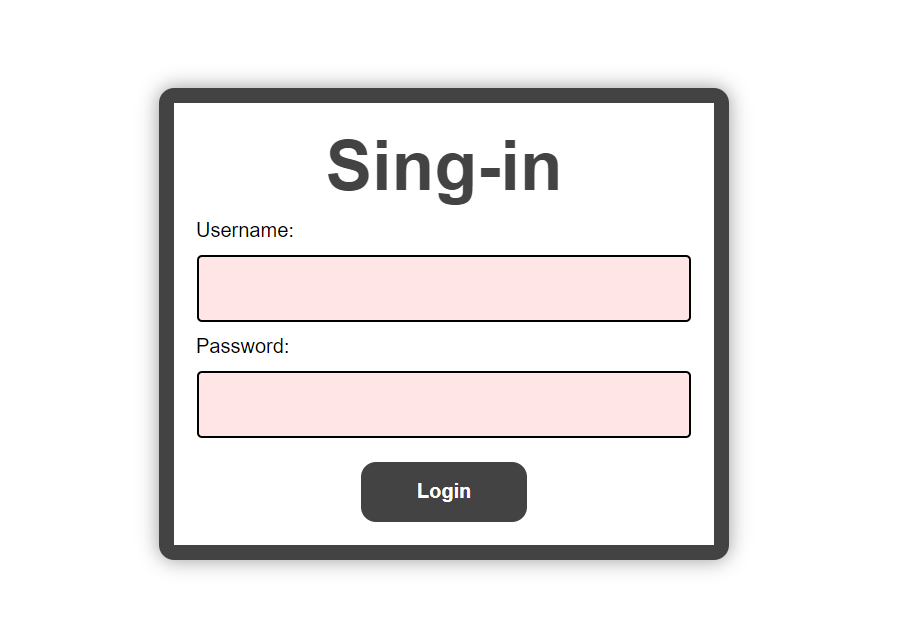
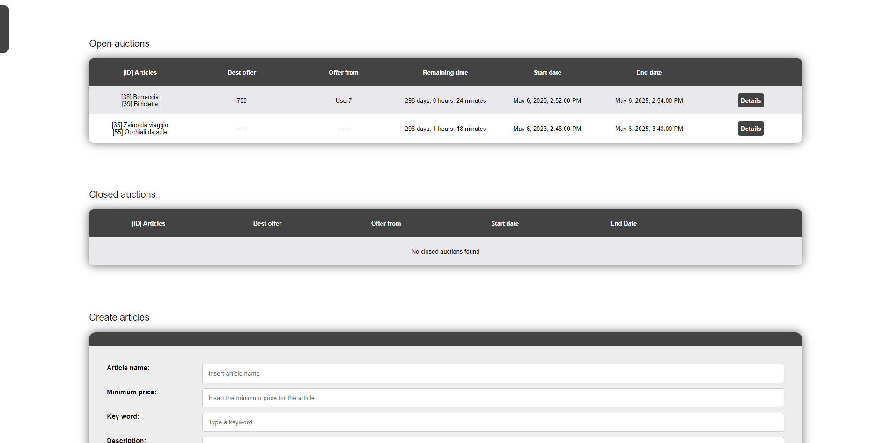
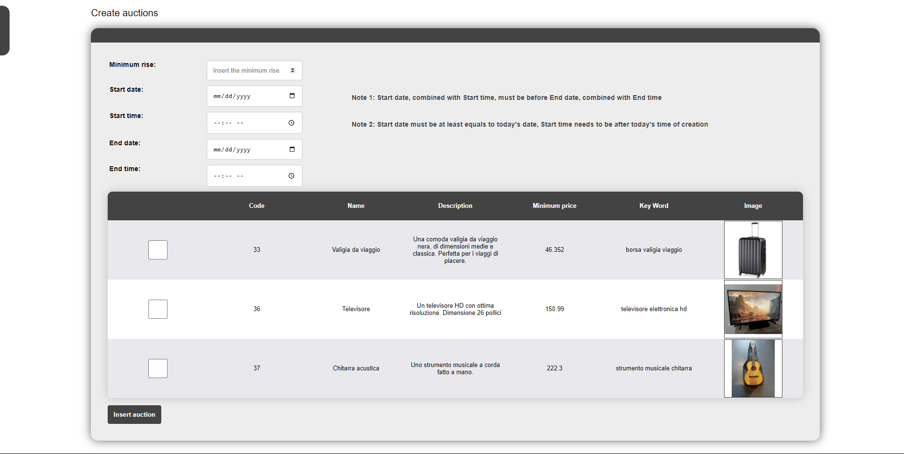
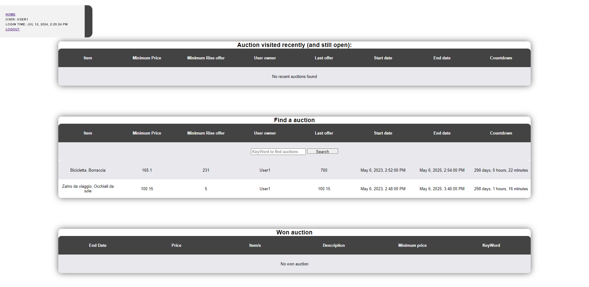
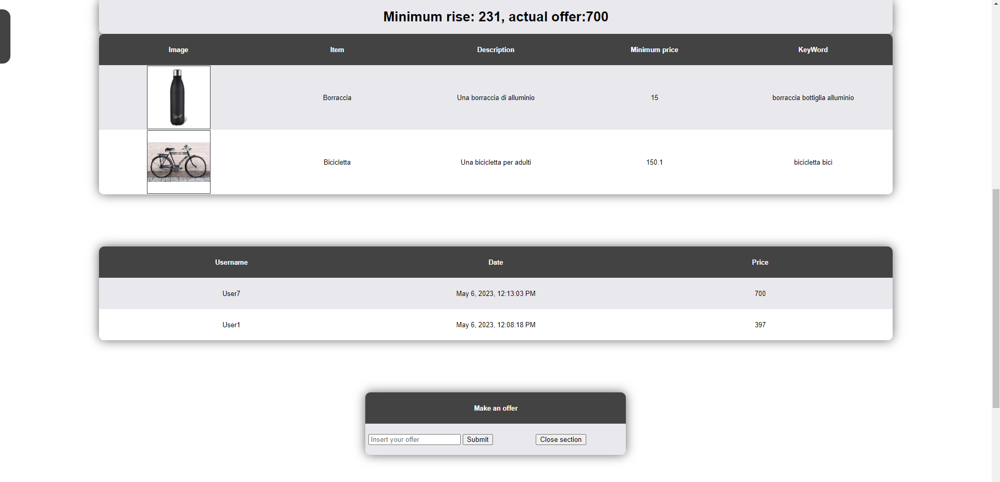

## Progetto Tecnologie Infromatiche per il Web
Questa è la repository che comprende il progetto del corso di Tecnologie Informatiche per il Web, anno 2022/23 del Politecnico di Milano.

## Struttura della repository
- Project Delivery: Cartella in cui è presente il PDF contenente la traccia del progetto.
- Database: Cartella in cui è presente il file .sql del database che abbiamo usato.
- images_folder: Cartella in cui sono presenti le immagini usate da entrambi i progetti.
- AstaPureHTML: Versione del progetto puramente HTML.
- AstaRIA: Versione del progetto che utilizza Javascript. 
- readme.md e readme_images: FIle di intestazione della repository.

## Deployment
Il seguente tutorial è valido per entrambe le versioni (HTML e Javascript) del progetto. 
Nota: I progetti sono stati sviluppati con IntelliJ IDEA e il tutorial sarà basato su questa IDE.
### Importazione Database
I progetti utilizzano un database SQL per memorizzare i dati degli utenti e delle aste.
Per importare il database, seguire i seguenti passaggi:
- Installare MySQL Workbench.
- Importare il Database che trovate nella cartella Database.
- Modificare il file del progetto (AstaPureHTML o AstaRia) src/main/webapp/WEB-INF/web.xml:

  

- Nel riquadro GIALLO inserire la porta di servizio del database (di default è 3306), e poi inserire il nome del database.
(Questo passaggio è gia configurato se si sta importando il database fornito con il progetto).
- Nel riquadro BLU inserire l'username che si utilizza per accedere al database.
- Nel riquadro VERDE inserire la password che si utilizza per accedere al database.

### Configurazione JDK
Per poter eseguire i progetti, è necessario configurare il JDK.
- Aprire IntelliJ IDEA e aprire AstaPureHTML o AstaRIA.
- Nel menù in alto, cliccare su File -> Project Structure.
- Nella finestra che si apre, nella sezione Project Settings -> Project, è possibile scaricare/aggiungere un JDK.
Nota: Una configurazione errata impedisce ad alcune librerie java di essere riconosciute, quindi la build del progetto non termina correttamente

### Configurazione Tomcat
Per poter eseguire i progetti, è necessario configurare Tomcat.ù
- Scaricare Tomcat in versione .zip da [questa pagina](https://tomcat.apache.org/download-90.cgi).
- Estrarre il file .zip in una cartella prendendo nota del path.
- Aprire IntelliJ IDEA e aprire AstaPureHTML o AstaRIA.
- Nel menù in alto, cliccare su Run -> Edit Configurations -> Add New Configuration.
- Cliccare su Tomcat Server -> Local.
- Nella finestra che si apre, nella voce Application Server e tramite il pulsante Configure, inserire il path in cui si ha estratto Tomcat.
- Nella voce Deployment, cliccare su + -> Artifact -> AstaPureHTML:war exploded o AstaRIA:war exploded.
- A questo punto il pulsante Run sarà attivo e si potrà eseguire il progetto.

  

- A questo punto è possibile loggarsi con uno degli User memorizzati nel Database (Nel database predefinito ad esempio possiamo loggarci con [User1, pass]...)

### Gestione immagini
Entrambi i progetti memorizzano le immagini degli articoli degli utenti all'interno della cartella images_folder. Se si utilizza il database fornito con il progetto, le immagini sono già presenti nella cartella.
Se si vuole usare un database nuovo, si può tranquillamente svuotare tale cartella, le nuove immagini verranno caricate li automaticamente.

## AstaPureHTML
Il progetto AstaPureHTML è stato sviluppato utilizzando solo HTML.
Il lato server è gestito tramite Servlet che vengono richiamate dall'utente con le interazioni HTML.
Le servlet restituiscono una nuova pagina HTML con i contenuti aggiornati richiesti dall'utente.

## AstaRIA
Il progetto AstaRIA è stato sviluppato utilizzando Javascript.
Il lato server è gestito ancora da Servlet, ma queste sono diverse rispetto a quelle di AstaPureHTML.
Le servlet non restituiscono l'intera pagina da mostrare all'utente, bensi sono i nuovi contenuti informativi da mostrare.
I contenuti sono codificati in formato JSON e il Javascript lato client è in grado di richiederli ed estrarli comodamente.
Il lato client utilizza un meccanismo di callback per queste richieste

## Screenshots
Pagina Sell

  
  

Pagina Buy

  
  

